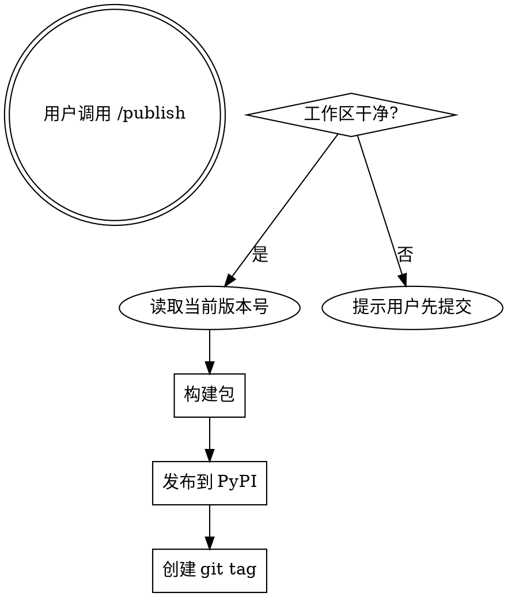

$ARGUMENTS

## Overview

发布新版本到 PyPI。一步完成：检查工作区 → 版本号确认 → 构建包 → 发布。

## 执行流程



## 执行步骤

1. **检查工作区**
   ```bash
   git status --porcelain
   ```
   如有未提交改动，提示用户先 `/commit`，中止发布。

2. **确认版本号**
   ```bash
   grep '^version' pyproject.toml | head -1
   ```
   读取当前版本号，展示给用户确认。版本号仅在 pyproject.toml 中维护，cli.py 通过 `importlib.metadata` 动态读取。

3. **清理旧包并构建**
   ```bash
   rm -f dist/*
   uv build
   ```

4. **发布到 PyPI**
   ```bash
   source ~/.zshrc 2>/dev/null; uv publish
   ```
   凭据从 `UV_PUBLISH_TOKEN` 环境变量读取。需要先 `source ~/.zshrc` 确保 token 加载。

5. **验证与打 tag**
   发布成功后，为当前 commit 创建 `v{version}` tag：
   ```bash
   git tag v{version}
   ```

## 注意事项

- 版本号只在 `pyproject.toml` 维护，`src/blink/cli.py` 通过 `importlib.metadata.version("blink-repo")` 动态读取
- 发布前必须确保工作区干净
- `source ~/.zshrc` 是必须的，Claude Code shell 不自动加载用户 shell 配置
